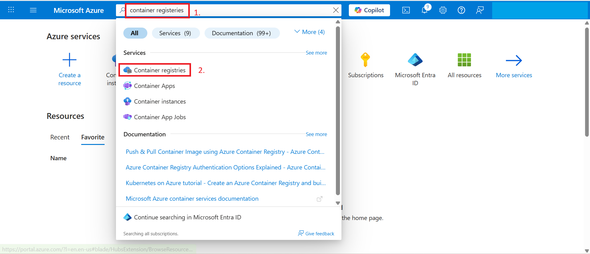
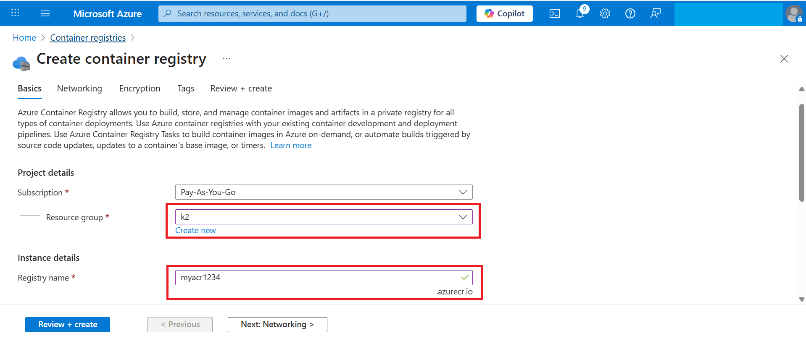
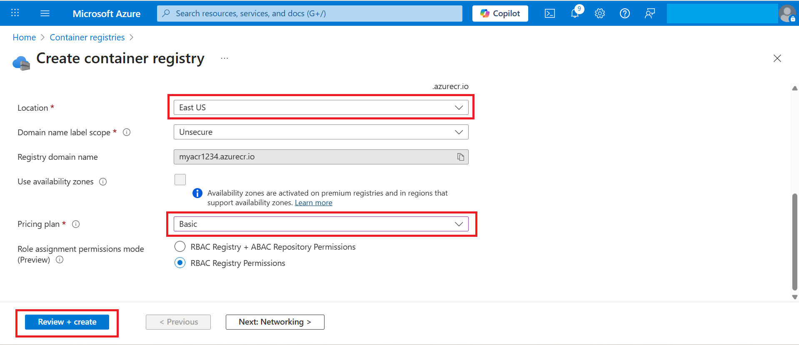
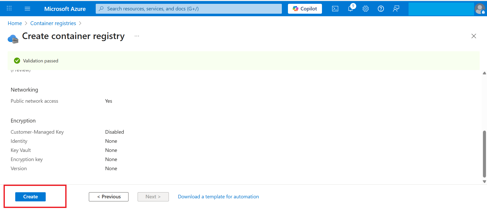
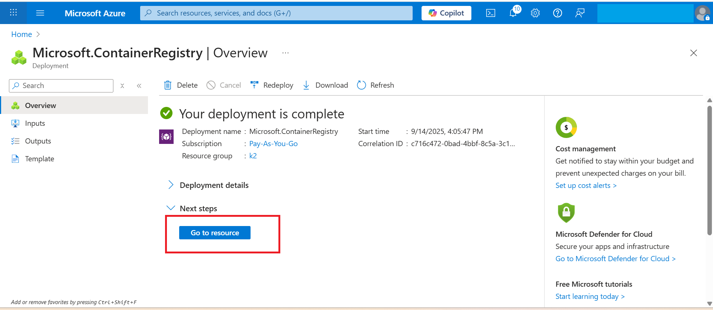
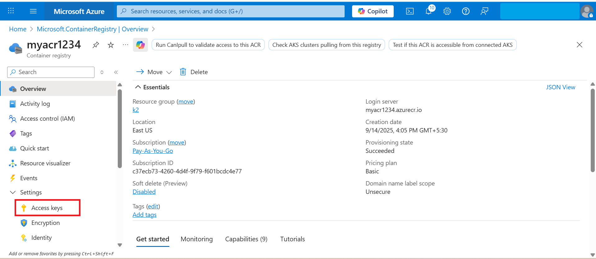
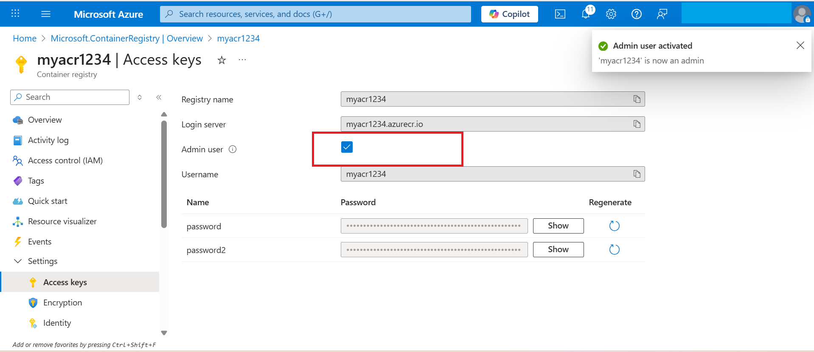

# Exercise 1 – Creating an Azure Container Registry (ACR)
**In this exercise, you will create an Azure Container Registry (ACR). This private registry will allow you to securely build, store, and manage container images that you will later deploy in Azure Container Instances.**

1. In the Azure Portal, search for **Container Registries** → Click **Create**.
   
   

3. Fill in the details:  
   - **Resource Group**: Use the resource group provided in your lab environment.  
   - **Registry Name**: `myacr<DID>`  **use the deployemnt id that you have as the prefix of myacr**
     
     
   - **Location**: East US  
   - **Pricing Plan**: Basic  
   - Leave other settings as default.  
     

4. Click **Review + Create** → **Create**.  
   

   Once the deployment is complete, your ACR is created.  

5. Click **Go to Resource** to open your ACR (`myacr1234`).  
   

6. In the left menu, click **Access Keys**.  
   

7. Enable **Admin User = Enabled**.  
   

   When you enable this, Azure automatically configures internal credentials for your ACR.  
   These consist of:  
   - **Username**  
   - **Password1** and **Password2**  

   > ⚡ Note: You  need to **enter these manually during the lab while login to ACR to push the image that you will  create locally in next step**.
 
