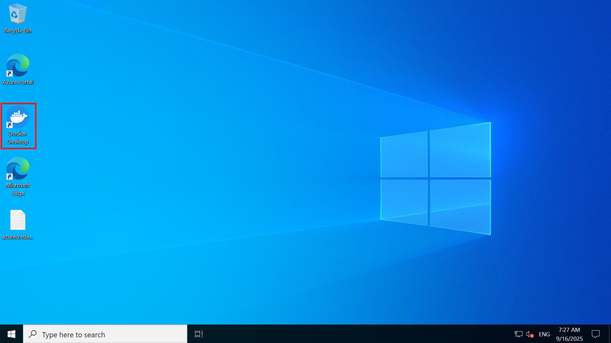
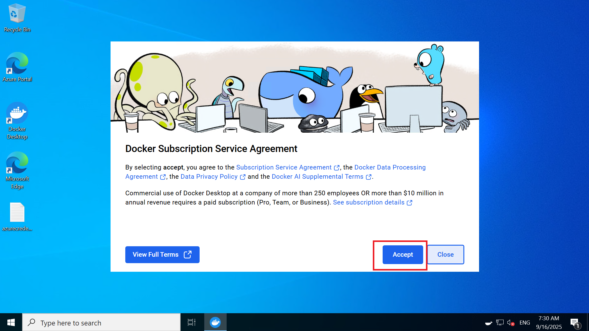
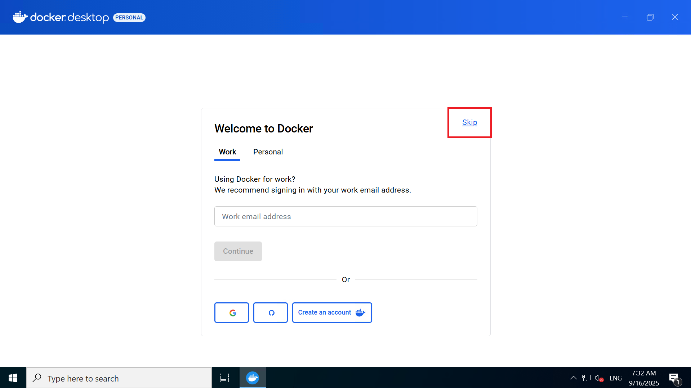
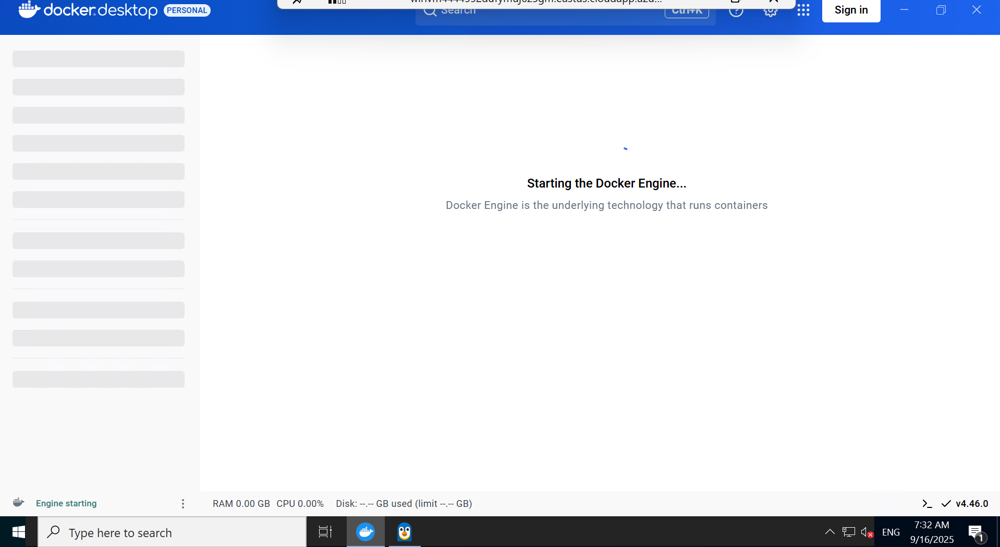
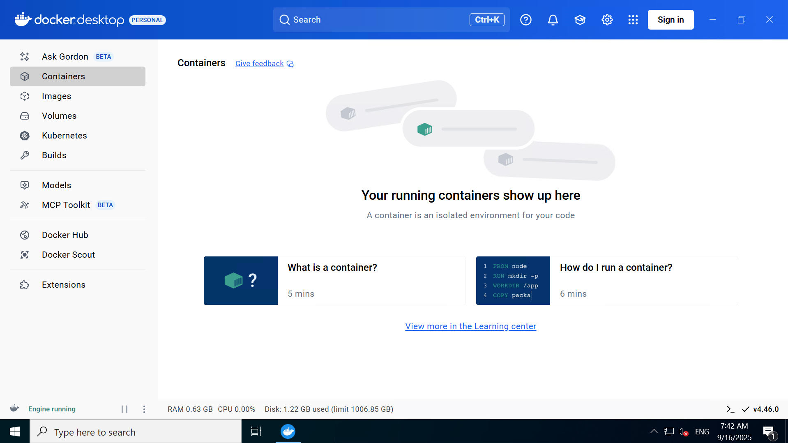
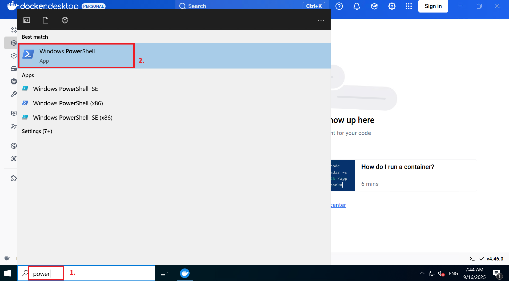
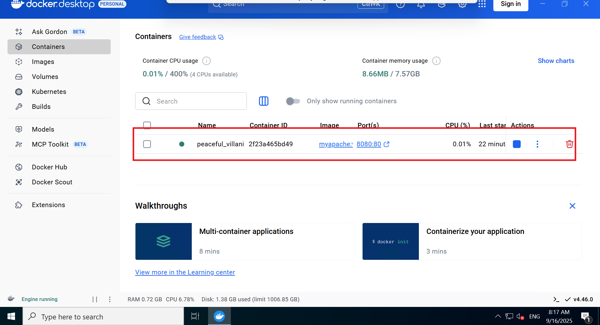
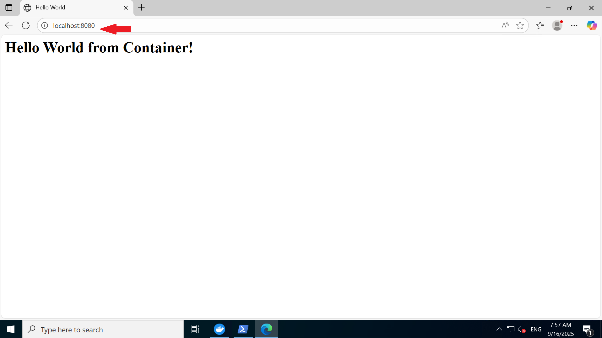
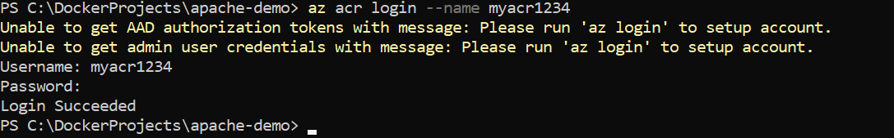
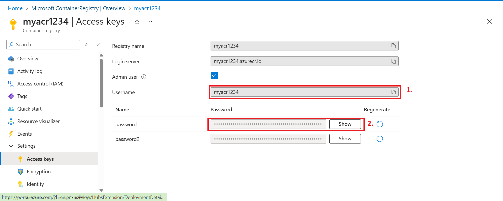

# Exercise 2 – Building and Pushing a Docker Image to ACR (Using Docker Desktop)

In this exercise, you will build a Docker image locally using **Docker Desktop** and then push it to **Azure Container Registry (ACR)**.

---

### 1. Start Docker Desktop
- Click the **Docker Desktop** shortcut to open it.
  
  
  
- Accept the **Service Agreement** prompt.
  
  
  
- Click **Skip** on the sign-in prompt.
    
  
  
- Wait 5–7 minutes for Docker to fully start.
  
  
  
- If a **WSL prompt** appears, simply close it.
  
- Once Docker is running, you should see the whale 🐳 icon in the system tray and the Docker Desktop app:
  
    

---

### 2. Verify Docker Installation
Open **Windows PowerShell**.  

  

Run:

```powershell
docker --version
```

Example output:  

Docker version 28.4.0, build d8eb465


---

### 3. Create a Project Directory

```powershell
mkdir C:\DockerProjects\apache-demo
```

**Change the directory**

```powershell
cd C:\DockerProjects\apache-demo
```

---

### 4. Create a Dockerfile

```powershell
@"
FROM httpd:2.4
COPY ./index.html /usr/local/apache2/htdocs/index.html
"@ | Out-File -FilePath Dockerfile -Encoding utf8 -Force
```

---

### 5. Create an index.html

```powershell
@"
<html>
  <head><title>Hello World</title></head>
  <body><h1>Hello World from Container!</h1></body>
</html>
"@ | Out-File -FilePath index.html -Encoding utf8 -Force
```

---

### 6. Verify Files
Check that both files were created:

```powershell
dir
```

Expected files:  
- **Dockerfile**  
- **index.html**

---

### 7. Build the Docker Image

```powershell
docker build -t myapache:v1 .
```

Verify the image exists:  

```powershell
docker images
```

---

### 8. Run & Test Locally
Run the container:

```powershell
docker run -d -p 8080:80 myapache:v1
```

You should see the running container inside Docker Desktop: 

  

Now open 👉 **<http://localhost:8080>** in your Edge browser.  

You should see the Hello World page 🎉  

  


⚡ Note: This test is running **locally** on your system. Next, we’ll push the image to Azure.


---

### 9. Push the Image to ACR
1. **Login to ACR**:
   ```powershell
   az acr login --name myacr<DID>
   ```
     

   Enter the **Username** and **Password** from the ACR **Access Keys** (enabled earlier).

     

2. **Tag the image for ACR**:
   
   ```powershell
   docker tag myapache:v1 myacr<DID>.azurecr.io/myapache:v1
   ```

3. **Push the image to ACR**:
   
   ```powershell
   docker push myacr<DID>.azurecr.io/myapache:v1
   ```

✅ Your Docker image is now built locally and successfully pushed to **Azure Container Registry (ACR)**.  
