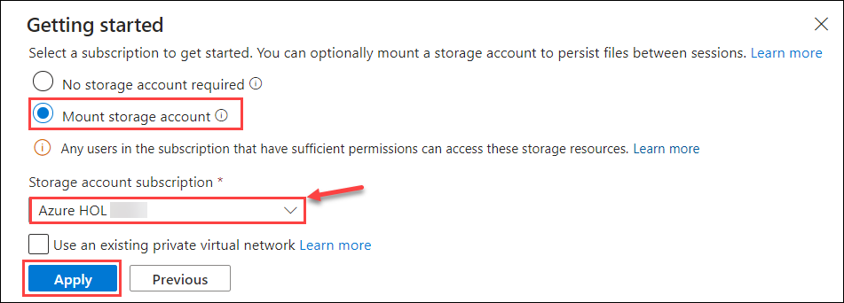
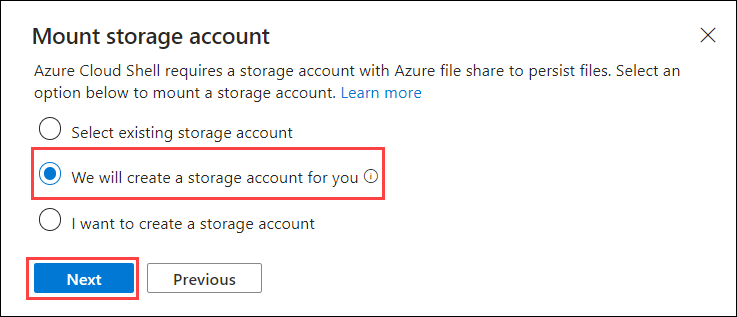
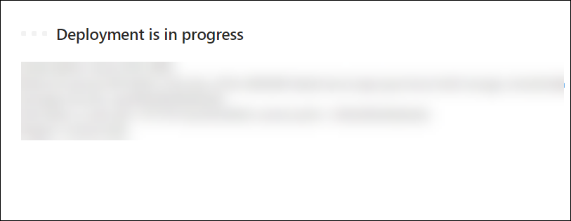
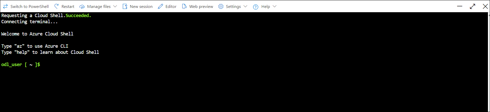
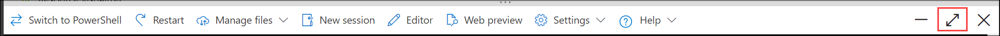
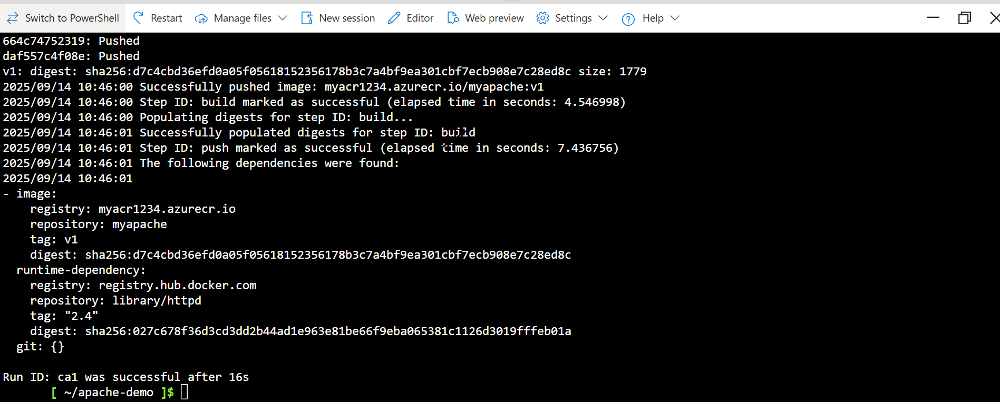

# Exercise 2 – Using Cloud Shell to Prepare Docker Build Files
**In this exercise, you will use Azure Cloud Shell to create Docker build files. You will write a Dockerfile, create a sample HTML file, and build a container image that will be stored in your ACR.**

1. In the Azure Portal, click the **Cloud Shell** icon.
   
   

3. In the **Welcome to Azure Cloud Shell** window, choose **Bash**.
    
   

4. In the Getting Started window:  
   - Select **Mount Storage Account**.  
   - Choose the default subscription → Click **Apply**.
     
     
     
   - On the **Mount Storage Account** screen, choose **We will create a storage account for you** → Click **Next**.
     
     
     
   - Wait 2–3 minutes for deployment to complete.
      
       

5. Once the deployment finishes, the Cloud Shell will be ready.
    
     

6. Maximize the Cloud Shell window using the maximize button in the Cloud Shell bar.
     
     

7. Create a working directory:
 
```bash
mkdir apache-demo
cd apache-demo
```
   
7.Create a Dockerfile:

```bash
cat <<EOF > Dockerfile
FROM httpd:2.4
COPY ./index.html /usr/local/apache2/htdocs/index.html
EOF
```


8.Create an index.html file:

```bash
cat <<EOF > index.html
<html>
  <head><title>Hello World</title></head>
  <body><h1>Hello World from Azure Container!</h1></body>
</html>
EOF
```


9.Build and push the image to ACR (this automatically uses ACR credentials internally – no need to enter them manually):

```bash
az acr build --registry myacr1234 --image myapache:v1 .
```


After this, your image will be successfully built and stored in ACR.

