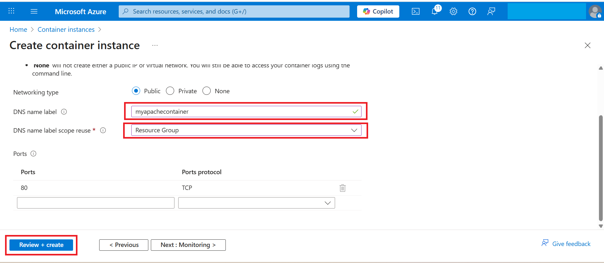
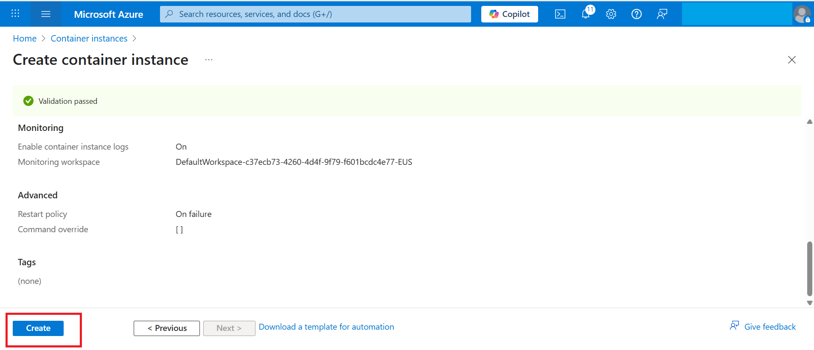

# Exercise 3 – Deploying the Container Instance

1. In the Azure Portal, search for **Container Instances** → Click **Create**.  
     

2. Fill in the details:  
   - **Resource Group**: Use the default RG provided.  
   - **Container Name**: `myapache-container`  
   - **Region**: East US  
     

   - **Image Source**: Azure Container Registry  
   - **Registry**: Select `myacr1234`  
   - **Image**: `myapache:v1`  
   - **OS Type**: Linux  
   - **Size**: Leave default (1 vCPU, 1.5GB RAM)  
     

3. Networking:  
   - **DNS Name Label**: `myapachecontainer` (must be unique).  
   - **Port**: 80  
     

4. Click **Review + Create** → **Create**.  
     

5. Wait for the deployment to complete.  
     

✅ Now your deployment is complete. Click **Go to resource** to view your container instance, which should now be running and accessible.
