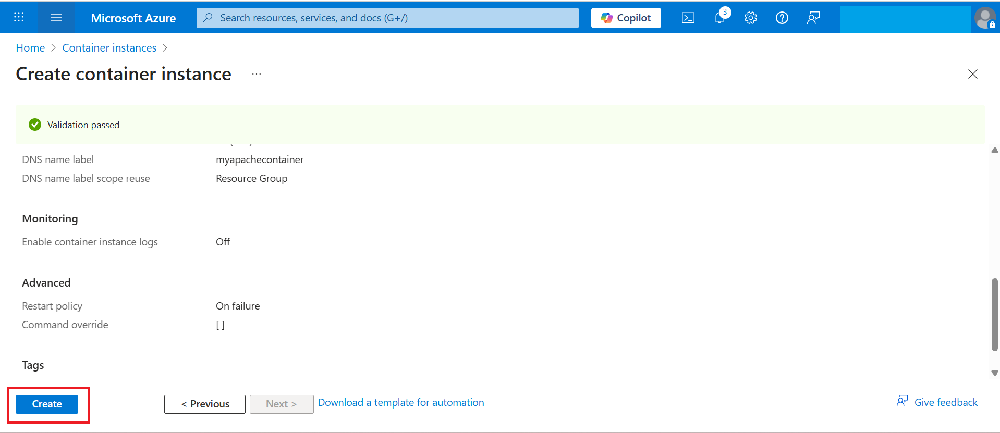

# Exercise 3 – Deploying the Container Instance
**In this exercise, you will deploy your custom container image from ACR to an Azure Container Instance (ACI). You will configure networking and validate that the container is running successfully.**

1. In the Azure Portal, search for **Container Instances** → Click **Create**.  

   

3. Fill in the details:  
   - **Resource Group**: Use the default RG provided.  
   - **Container Name**: `myapache-container`  
   - **Region**: East US
     
     

   - **Image Source**: Azure Container Registry  
   - **Registry**: Select `myacr<DID>`  
   - **Image**: `myapache:v1`  
   - **OS Type**: Linux  
   - **Size**: Leave default (1 vCPU, 1.5GB RAM)
       
     

4. Networking:  
   - **DNS Name Label**: `myapachecontainer` (must be unique).
   - **Port**: 80
     
     

5. Monitoring:
   In the Monitoring tab (do not enable diagnostics).
   - **uncheck the box**
   
   
   
7. Click **Review + Create** → **Create**.
   
     

9. Wait for the deployment to complete.
    
     

✅ Now your deployment is complete. Click **Go to resource** to view your container instance, which should now be running and accessible.
