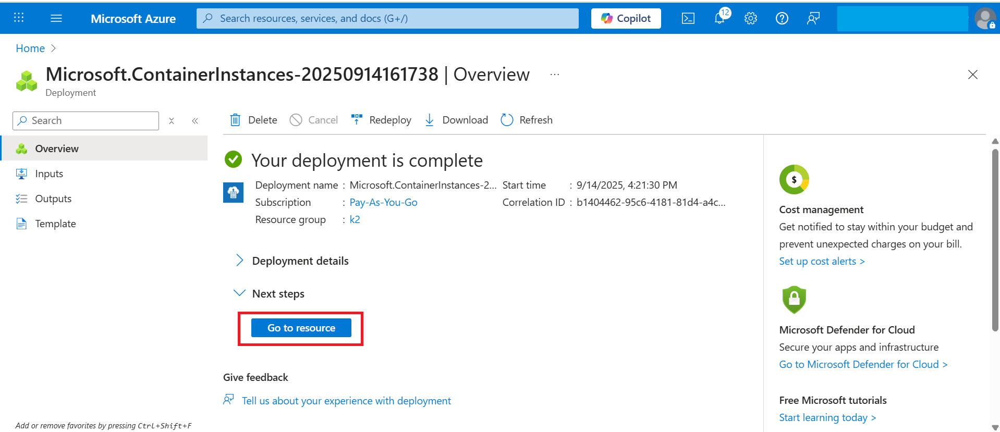
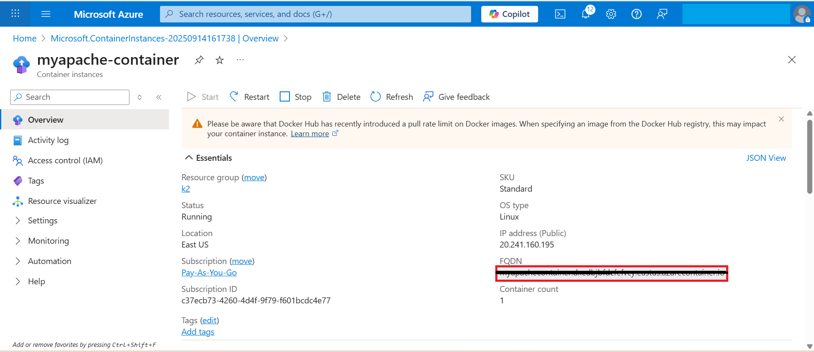
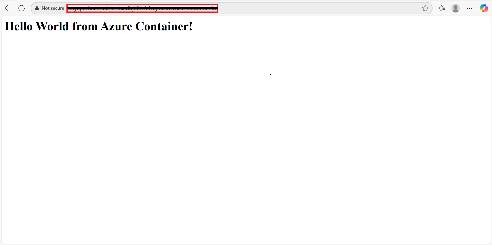

# Exercise 4 - Verifying the Deployment and Accessing Apache Server
**In this exercise, you will verify that your containerized Apache server is accessible via its public FQDN. You will test the deployment by accessing the "Hello World" page served from the container.**

1. Navigate to your **Container Instance** → Click **Go to Resource**.
   
     

3. Copy the **FQDN**.
   
     

5. Open the FQDN in your browser to access the Apache server.
   http://<Your FQDN>
   
   

    ✅ Now your Apache server is accessible.  
   You should see the response:  

   **Hello World from Azure Container!**  

   > ℹ️ This confirms that your Docker image was successfully built, pushed to Azure Container Registry, and deployed on an Azure Container Instance.  
   > The `index.html` file you created is being served by the Apache HTTP server running inside your container.
 
