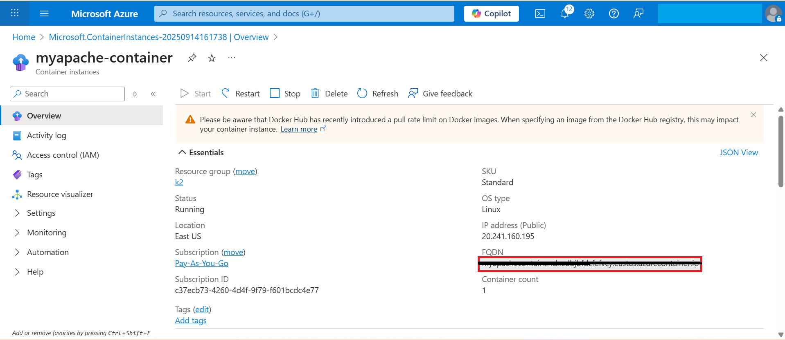

# Verifying the Deployment and Accessing Apache Server

1. Navigate to your **Container Instance** → Click **Go to Resource**.  
     

2. Copy the **FQDN**.  
     

3. Open the FQDN in your browser to access the Apache server.  
     
