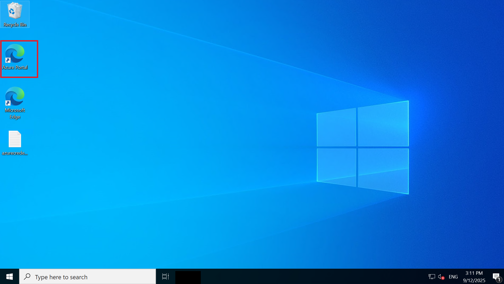

# Lab 1 – Logging into Azure Account

Follow the steps below to log in to your Azure account:

1. Open the **Azure Portal** using the desktop shortcut on your VM.
2.   
3. Click **Start without syncing your data**.  
4. Click **Confirm and continue**.  
5. Click **Continue without Google data**.  
6. Click **Confirm** and start browsing.

On your VM, you will have a file named **azurecredentials**.  
Take the credentials from this file and use them to log into the Azure account.

- On the **Sign into Microsoft Azure** screen:  
  - Enter the provided **Email/Username** → Click **Next**.  
  - Enter the **Password** → Click **Sign in**.  

**Note:**  
- If you see a popup *Action Required* for 2FA setup, click **Ask Later**.  
- If you see *Stay Signed in?*, click **No**.  
- If a *Welcome to Microsoft Azure* tour popup appears, click **Cancel**.  

You are now logged in to the Azure Portal via the Edge browser shortcut.
