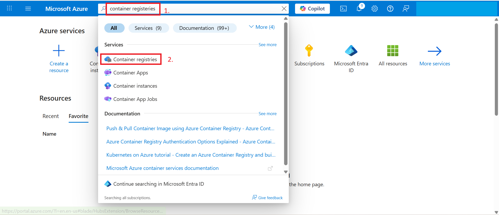
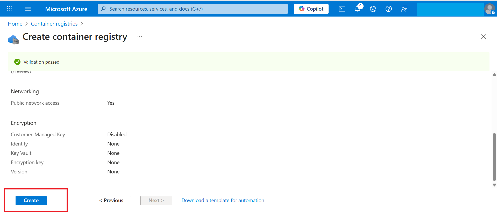
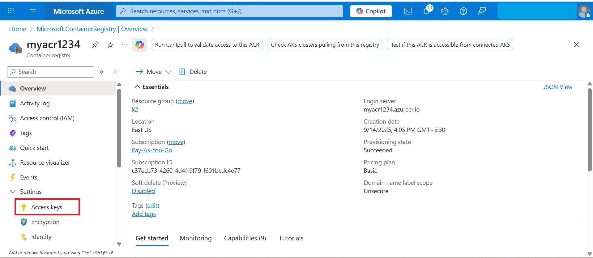

# Lab 2 – Creating an Azure Container Registry (ACR)

1. In the Azure Portal, search for **Container Registries** → Click **Create**.  

2. Fill in the details:
   - **Resource Group**: Use the resource group provided in your lab environment.  
   - **Registry Name**: `myacr1234`  
   
   - **Location**: East US  
   - **Pricing Plan**: Basic  
   - Leave other settings as default.  

4. Click **Review + Create** → **Create**.  

Once the deployment is complete, your ACR is created.  

4. Click **Go to Resource** to open your ACR (`myacr1234`).  

5. In the left menu, click **Access Keys**.  

6. Enable **Admin User = Enabled**.  

You will now see:  
- **Username**  
- **Password1** and **Password2**  

These credentials are required to pull/push images from the registry.
